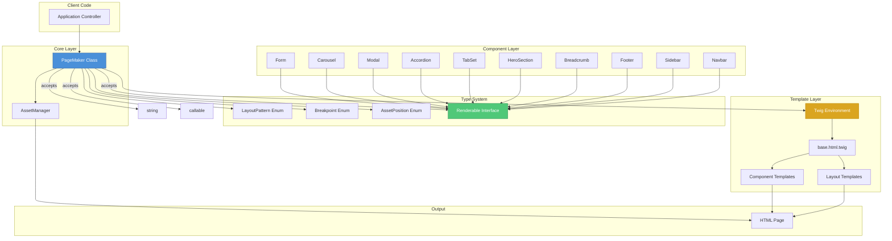
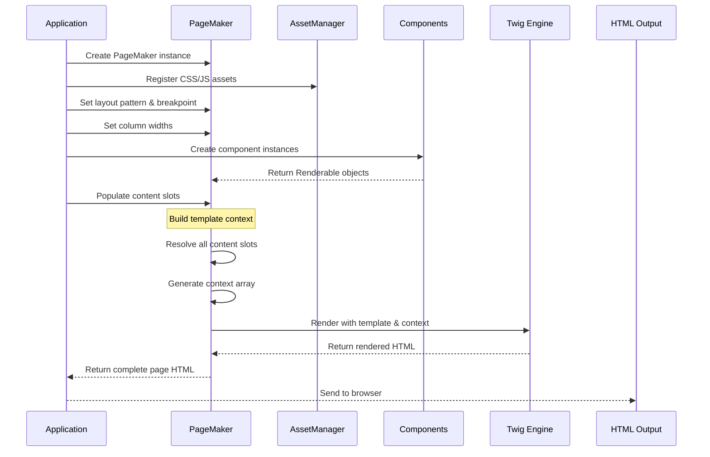
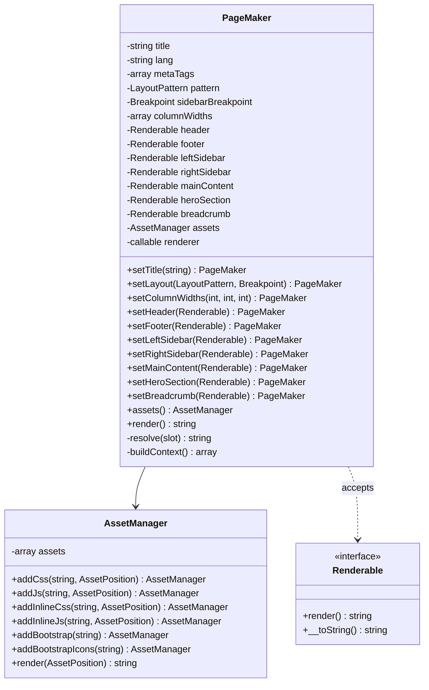
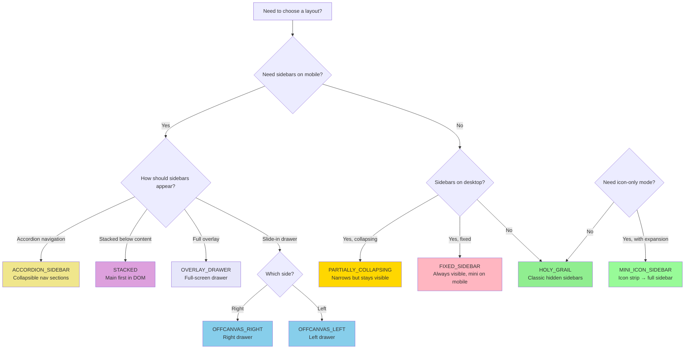
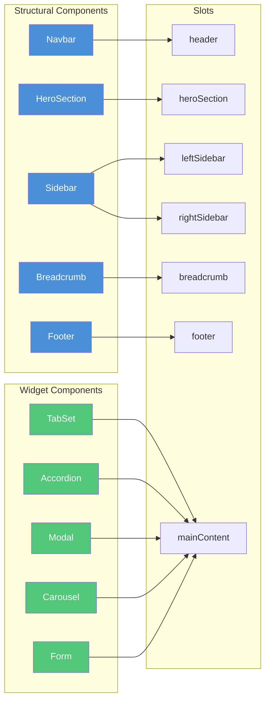
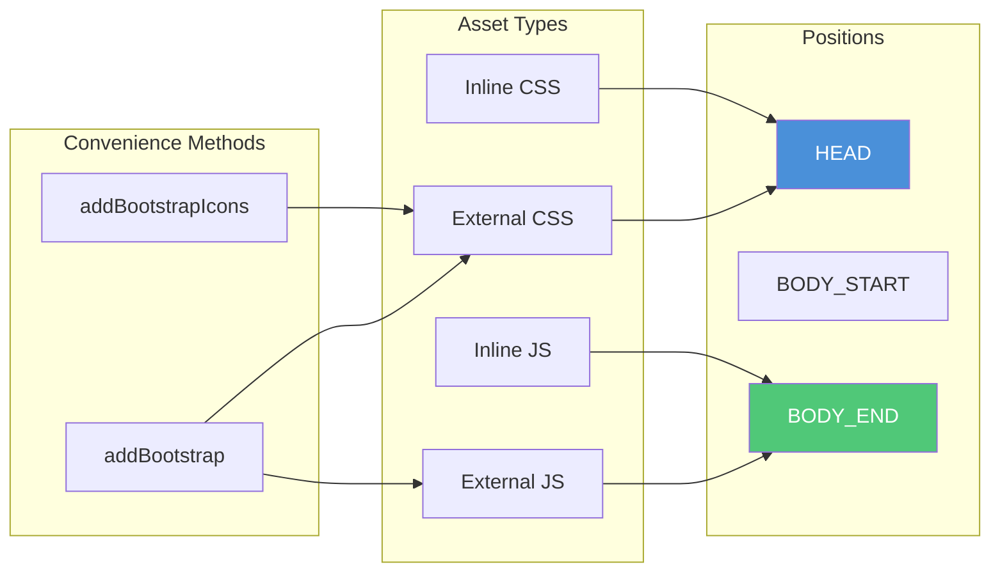
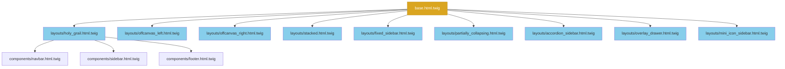
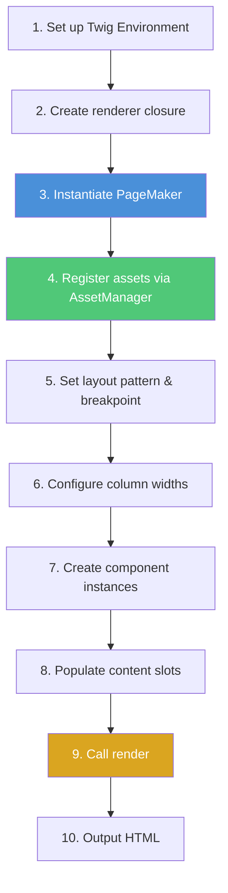

# PageMaker — System Architecture & Specification

A mobile-first, responsive page layout system built on **Bootstrap 5.3**, **PHP 8.2+**, and the Twig templating engine.

---

## Table of Contents

1. [Architecture Overview](#1-architecture-overview)
2. [Core Interfaces and Enums](#2-core-interfaces-and-enums)
3. [The PageMaker Class](#3-the-pagemaker-class)
4. [Layout Patterns](#4-layout-patterns)
5. [Structural Sections](#5-structural-sections)
6. [Interactive Widgets & UI Components](#6-interactive-widgets--ui-components)
7. [Grid System & Breakpoint Reference](#7-grid-system--breakpoint-reference)
8. [Asset Management](#8-asset-management)
9. [Template Specifications](#9-template-specifications)
10. [Usage Patterns](#10-usage-patterns)

---

## 1. Architecture Overview

### 1.1 Design Philosophy

PageMaker treats a web page as a **composition of structural sections** (header, footer, left sidebar, right sidebar, main content) arranged according to a named **layout pattern**. Every section accepts content as `string|Renderable|callable`, giving consumers three ways to populate any slot:

| Content Type | Example | When to Use |
|---|---|---|
| `string` | `'<h1>Hello</h1>'` | Static HTML or simple text |
| `Renderable` | `new Breadcrumb($items)` | Reusable component objects |
| `callable` | `fn() => $twig->render(...)` | Lazy evaluation, expensive queries |

The system is **mobile-first**: every template starts with the smallest-viewport layout and layers on complexity at wider breakpoints using Bootstrap's responsive utilities.

### 1.2 Technology Stack

| Layer | Technology | Role |
|---|---|---|
| Runtime | PHP 8.2+ | Class model, enums, interfaces |
| Templates | Twig 3.x | HTML generation |
| CSS Framework | Bootstrap 5.3.x | Grid, utilities, components |
| Icons | Bootstrap Icons 1.11+ | Sidebar/icon-strip icons |
| JavaScript | Bootstrap 5.3 bundle (Popper included) | Offcanvas, collapse, dropdowns |

### 1.3 High-Level Architecture

The PageMaker system follows a **builder pattern** with clear separation of concerns:



### 1.4 Data Flow



### 1.5 Directory Structure

```
pagemaker/
├── src/
│   ├── Enums/
│   │   ├── LayoutPattern.php
│   │   ├── Breakpoint.php
│   │   └── AssetPosition.php
│   ├── Contracts/
│   │   └── Renderable.php
│   ├── Components/
│   │   ├── Navbar.php
│   │   ├── Sidebar.php
│   │   ├── Breadcrumb.php
│   │   ├── TabSet.php
│   │   ├── Accordion.php
│   │   ├── Modal.php
│   │   ├── Carousel.php
│   │   ├── Footer.php
│   │   ├── HeroSection.php
│   │   └── Form.php
│   ├── Assets/
│   │   └── AssetManager.php
│   └── PageMaker.php
├── templates/
│   ├── base.html.twig
│   ├── layouts/
│   │   ├── holy_grail.html.twig
│   │   ├── offcanvas_left.html.twig
│   │   ├── offcanvas_right.html.twig
│   │   ├── stacked.html.twig
│   │   ├── fixed_sidebar.html.twig
│   │   ├── partially_collapsing.html.twig
│   │   ├── accordion_sidebar.html.twig
│   │   ├── overlay_drawer.html.twig
│   │   └── mini_icon_sidebar.html.twig
│   └── components/
│       ├── navbar.html.twig
│       ├── sidebar.html.twig
│       ├── breadcrumb.html.twig
│       ├── tabset.html.twig
│       ├── accordion.html.twig
│       ├── modal.html.twig
│       ├── carousel.html.twig
│       ├── footer.html.twig
│       ├── hero.html.twig
│       └── form.html.twig
├── public/
│   └── css/
│       └── pagemaker.css
└── tests/
```

---

## 2. Core Interfaces and Enums

### 2.1 Renderable Interface

Every component that can fill a layout slot implements this interface. It defines two methods:
- `render(): string` — Returns the component as an HTML string
- `__toString(): string` — Allows echo/string coercion

This enables any component to be used interchangeably in content slots.

### 2.2 LayoutPattern Enum

Defines the nine available layout patterns, each mapping to a specific Twig template:

| Pattern | Template | Description |
|---|---|---|
| `HOLY_GRAIL` | `layouts/holy_grail.html.twig` | Classic three-column layout |
| `OFFCANVAS_LEFT` | `layouts/offcanvas_left.html.twig` | Left drawer on mobile, inline on desktop |
| `OFFCANVAS_RIGHT` | `layouts/offcanvas_right.html.twig` | Right drawer on mobile, inline on desktop |
| `STACKED` | `layouts/stacked.html.twig` | Mobile-first with visual reordering |
| `FIXED_SIDEBAR` | `layouts/fixed_sidebar.html.twig` | Position-fixed sidebar with mini collapse |
| `PARTIALLY_COLLAPSING` | `layouts/partially_collapsing.html.twig` | Always-visible narrowing sidebar |
| `ACCORDION_SIDEBAR` | `layouts/accordion_sidebar.html.twig` | Sidebar with collapsible accordion sections |
| `OVERLAY_DRAWER` | `layouts/overlay_drawer.html.twig` | Full-screen overlay drawer on mobile |
| `MINI_ICON_SIDEBAR` | `layouts/mini_icon_sidebar.html.twig` | Icon strip expanding to full sidebar |

### 2.3 Breakpoint Enum

Maps Bootstrap 5.3's six breakpoint tiers to PHP constants:

| Enum Case | Class Infix | Min Width | Typical Device |
|---|---|---|---|
| `XS` | *(none)* | $0\text{px}$ | Phones (portrait) |
| `SM` | `-sm` | $\geq 576\text{px}$ | Phones (landscape) |
| `MD` | `-md` | $\geq 768\text{px}$ | Tablets |
| `LG` | `-lg` | $\geq 992\text{px}$ | Laptops / small desktops |
| `XL` | `-xl` | $\geq 1200\text{px}$ | Desktops |
| `XXL` | `-xxl` | $\geq 1400\text{px}$ | Large desktops / TVs |

Each breakpoint provides methods to retrieve pixel values and generate Bootstrap class infixes.

### 2.4 AssetPosition Enum

Defines three insertion points for assets:
- `HEAD` — Inside `<head>` (CSS, meta tags)
- `BODY_START` — Immediately after `<body>` (early JS, analytics)
- `BODY_END` — Before `</body>` (main JS bundles)

---

## 3. The PageMaker Class

The central builder class collects configuration, resolves content slots, and delegates rendering to the template engine.

### 3.1 Core Responsibilities



### 3.2 Content Slot Resolution

The `resolve()` method handles the three content types:

1. **null** → Returns empty string
2. **string** → Returns as-is (raw HTML)
3. **Renderable** → Calls `render()` method
4. **callable** → Executes and recursively resolves the result

This allows lazy evaluation for expensive operations like database queries.

### 3.3 Template Context Building

The `buildContext()` method assembles all data needed by templates:

| Context Variable | Source | Purpose |
|---|---|---|
| Metadata | `$title`, `$lang`, `$metaTags` | HTML head elements |
| Layout config | `$pattern`, `$breakpoint`, `$columnWidths` | Responsive behavior |
| Resolved content | Slot resolution results | Body sections |
| Asset HTML | `AssetManager::render()` | CSS/JS tags |

### 3.4 Column Width Presets

For convenience, named presets simplify common configurations:

| Preset | Column Distribution | Use Case |
|---|---|---|
| `left-only` | `[3, 9, 0]` | Admin panels |
| `right-only` | `[0, 9, 3]` | Blog with sidebar ads |
| `both-narrow` | `[2, 8, 2]` | Three-column portal |
| `both-wide` | `[3, 6, 3]` | Traditional portal |
| `both-unequal` | `[3, 7, 2]` | Documentation with TOC |
| `no-sidebars` | `[0, 12, 0]` | Landing pages |

### 3.5 Mathematical Constraints

Column widths must satisfy:

$$\text{left} + \text{main} + \text{right} = 12$$

where $\text{main} \geq 1$ and $\text{left}, \text{right} \geq 0$.

---

## 4. Layout Patterns

Each pattern defines **how structural sections behave at the mobile breakpoint vs. the configured sidebar breakpoint**. All patterns share the same base template and override only the body block.

### 4.1 Pattern Behavior Matrix

| Pattern | Mobile (below $bp$) | At/Above $bp$ | Key Bootstrap Classes | Sidebars Used |
|---|---|---|---|---|
| **HOLY_GRAIL** | Single column; sidebars hidden | 3-column grid | `d-none d-{bp}-block`, `col-{bp}-*` | Left, Right |
| **OFFCANVAS_LEFT** | Hamburger toggles left drawer | Left sidebar visible inline | `offcanvas-{bp} offcanvas-start` | Left |
| **OFFCANVAS_RIGHT** | Hamburger toggles right drawer | Right sidebar visible inline | `offcanvas-{bp} offcanvas-end` | Right |
| **STACKED** | Single column; sidebars stack below main | 3-column; DOM order rearranged | `order-{bp}-*` | Left, Right |
| **FIXED_SIDEBAR** | Sidebar collapses to mini icon strip | Fixed-position sidebar + scrollable main | `position-fixed`, `sidebar-mini` | Left |
| **PARTIALLY_COLLAPSING** | Sidebar shows icons only (always visible) | Full sidebar with labels | `sidebar-narrow` ↔ `sidebar-wide` | Left |
| **ACCORDION_SIDEBAR** | Sidebar content in accordion | Expanded multi-level nav | Bootstrap `accordion` inside sidebar | Left |
| **OVERLAY_DRAWER** | Full-screen overlay drawer | Sidebar as normal grid column | `offcanvas` + `offcanvas-backdrop` | Left |
| **MINI_ICON_SIDEBAR** | Narrow icon strip, expand on tap | Full sidebar with text + icons | `sidebar-mini`, `d-none d-{bp}-inline` | Left |

### 4.2 Pattern Selection Guide



---

## 5. Structural Sections

These are the major semantic areas of every page. Each has a dedicated component class implementing `Renderable`.

### 5.1 Component Architecture



### 5.2 Navbar Component

**Properties:**
- Brand configuration (name, URL, optional logo)
- Navigation items (label → href mapping)
- Theme selection (light/dark)
- Positioning (static or sticky-top)
- Collapse breakpoint

**Accessibility:** Includes proper ARIA labels, keyboard navigation, and mobile-friendly hamburger toggle.

### 5.3 Hero Section Component

**Properties:**
- Title and subtitle
- Optional call-to-action button
- Background image with overlay support
- Theme-aware text coloring

**Use Cases:** Landing page headers, section separators, feature announcements.

### 5.4 Sidebar Component

**Properties:**
- Navigation items with icons and labels
- Optional heading section
- Support for nested children (multi-level navigation)
- Active state highlighting

**Critical Implementation Note:** The `<span class="pm-sidebar-label">` wrapper is essential. Patterns like MINI_ICON_SIDEBAR, FIXED_SIDEBAR, and PARTIALLY_COLLAPSING hide this span below the breakpoint to achieve icon-only mode.

### 5.5 Footer Component

**Properties:**
- Multiple columns of link groups
- Copyright text
- Social media icon links

**Layout:** Responsive grid that stacks on mobile.

### 5.6 Breadcrumb Component

**Properties:**
- Hierarchical navigation items
- Current page indicator (null href)
- Bootstrap breadcrumb styling

**Accessibility:** Includes `aria-label` and `aria-current` attributes.

---

## 6. Interactive Widgets & UI Components

Each widget implements `Renderable` and can be placed in any content slot.

### 6.1 Widget Feature Matrix

| Component | Bootstrap Feature | Configuration Options | Typical Slot |
|---|---|---|---|
| **TabSet** | Tabs / Pills | Style, orientation (horizontal/vertical), auto-generated IDs | Any content slot |
| **Accordion** | Accordion / Collapse | Multiple open sections, flush styling, auto-generated IDs | Any content slot |
| **Modal** | Modal dialog | Size variants, centered, scrollable, static backdrop | Any content slot |
| **Carousel** | Carousel / Slide | Controls, indicators, fade effect, auto-play interval | Any content slot |
| **Form** | Form controls | Field types, validation, CSRF token placeholder | Any content slot |

### 6.2 TabSet Component

**Purpose:** Organize related content sections within a single slot.

**Configuration:**
- Tab style: `tabs` or `pills`
- Orientation: `horizontal` or `vertical`
- Auto-generated unique IDs for accessibility

**Accessibility:** Full ARIA support with `role="tablist"`, `role="tab"`, `role="tabpanel"`, and `aria-selected` states.

### 6.3 Accordion Component

**Purpose:** Collapsible content sections with expand/collapse functionality.

**Configuration:**
- Allow multiple open sections
- Flush styling (edge-to-edge)
- Auto-generated unique IDs

### 6.4 Modal Component

**Purpose:** Dialog overlays for focused interactions.

**Configuration:**
- Size variants: default, small, large, extra-large, fullscreen
- Centered positioning
- Scrollable content area
- Static backdrop (prevents dismissal on click outside)
- Trigger button helper method

### 6.5 Carousel Component

**Purpose:** Image/content sliders with optional captions.

**Configuration:**
- Show/hide navigation controls
- Show/hide dot indicators
- Slide vs. fade transition
- Auto-play interval (0 = disabled)

### 6.6 Form Component

**Purpose:** Basic form builder with Bootstrap styling.

**Supported Field Types:**
- Standard inputs (text, email, password, etc.)
- Textarea
- Select dropdown
- Checkbox

**Features:**
- Label and placeholder support
- Required field marking
- CSRF token hidden field placeholder

---

## 7. Grid System & Breakpoint Reference

### 7.1 Bootstrap 5.3 Breakpoints

All responsive behaviors are governed by six tier breakpoints:

| Breakpoint | Infix | Min Width | Typical Device |
|---|---|---|---|
| Extra small | *(none)* | $0\text{px}$ | Phones (portrait) |
| Small | `-sm` | $\geq 576\text{px}$ | Phones (landscape) |
| Medium | `-md` | $\geq 768\text{px}$ | Tablets |
| Large | `-lg` | $\geq 992\text{px}$ | Laptops / small desktops |
| Extra large | `-xl` | $\geq 1200\text{px}$ | Desktops |
| Extra extra large | `-xxl` | $\geq 1400\text{px}$ | Large desktops / TVs |

### 7.2 Column Arithmetic

Bootstrap uses a **12-column grid**. The system enforces:

$$\text{left} + \text{main} + \text{right} = 12$$

where $\text{main} \geq 1$ and $\text{left}, \text{right} \geq 0$.

### 7.3 Responsive Class Generation

| Element | Mobile Class | Desktop Class | Visibility |
|---|---|---|---|
| Left sidebar | — | `col-{infix}-{width}` | `d-none d-{bp}-block` |
| Main content | `col-12` | `col-{infix}-{width}` | Always visible |
| Right sidebar | — | `col-{infix}-{width}` | `d-none d-{bp}-block` |

For **STACKED** pattern, `order-{bp}-*` classes control visual order while keeping main content first in DOM for SEO.

---

## 8. Asset Management

### 8.1 AssetManager Capabilities



### 8.2 Asset Registration Methods

| Method | Purpose | Default Position |
|---|---|---|
| `addCss($href)` | External stylesheet | HEAD |
| `addJs($src)` | External JavaScript | BODY_END |
| `addInlineCss($css)` | Inline style block | HEAD |
| `addInlineJs($js)` | Inline script block | BODY_END |
| `addBootstrap($version)` | Bootstrap CSS + JS bundle | HEAD + BODY_END |
| `addBootstrapIcons($version)` | Bootstrap Icons CSS | HEAD |

### 8.3 Default Asset Stack

Every PageMaker page should include at minimum:

| Asset | Position | Purpose |
|---|---|---|
| Bootstrap 5.3 CSS | HEAD | Grid, utilities, components |
| Bootstrap Icons CSS | HEAD | Sidebar/navigation icons |
| `pagemaker.css` | HEAD | Custom CSS variables + overrides |
| Bootstrap 5.3 JS bundle | BODY_END | Offcanvas, collapse, modal, etc. |

---

## 9. Template Specifications

### 9.1 Template Hierarchy



### 9.2 Base Template Structure

The base template provides:
- HTML document shell with configurable lang, charset, viewport
- Dynamic meta tags
- Title element
- HEAD assets injection point
- Header slot
- Main layout block (overridden by pattern templates)
- Footer slot
- BODY_END assets injection point

### 9.3 Template Variable Reference

Every layout template receives these variables from `PageMaker::buildContext()`:

**Metadata Variables:**
- `title` — HTML `<title>` content
- `lang` — `<html lang>` attribute
- `charset` — Character encoding
- `viewport` — Viewport meta content
- `meta_tags` — Array of additional meta tags

**Layout Variables:**
- `pattern` — Layout pattern value
- `breakpoint` — Breakpoint infix value
- `breakpoint_infix` — Prefixed infix (e.g., `-lg`)
- `col_left` — Left sidebar column width (0–11)
- `col_main` — Main content column width (1–12)
- `col_right` — Right sidebar column width (0–11)

**Content Variables (pre-resolved to HTML strings):**
- `header`, `footer`, `left_sidebar`, `right_sidebar`
- `main_content`, `hero_section`, `breadcrumb`

**Configuration Variables:**
- `body_class` — Extra `<body>` classes
- `container_id` — Wrapper div ID
- `fluid_container` — Boolean for fluid container

**Asset Variables:**
- `head_assets` — Pre-rendered `<link>`/`<style>` tags
- `body_start_assets` — Pre-rendered tags after `<body>`
- `body_end_assets` — Pre-rendered `<script>` tags

---

## 10. Usage Patterns

### 10.1 Typical Implementation Flow



### 10.2 Pattern Selection Quick Reference

| Use Case | Recommended Pattern | Breakpoint | Column Widths |
|---|---|---|---|
| Marketing site / blog | `HOLY_GRAIL` | `LG` | `[0, 9, 3]` or `[3, 6, 3]` |
| Admin dashboard | `OFFCANVAS_LEFT` | `LG` | `[3, 9, 0]` |
| Documentation site | `STACKED` | `MD` | `[3, 6, 3]` |
| Email client / CRM | `FIXED_SIDEBAR` | `LG` | N/A (CSS-driven) |
| Analytics dashboard | `PARTIALLY_COLLAPSING` | `LG` | N/A (CSS-driven) |
| Mobile-first app | `OVERLAY_DRAWER` | `LG` | `[3, 9, 0]` |
| IDE / tooling UI | `MINI_ICON_SIDEBAR` | `XL` | N/A (CSS-driven) |
| Content CMS with deep nav | `ACCORDION_SIDEBAR` | `MD` | `[3, 9, 0]` |
| Right-panel detail view | `OFFCANVAS_RIGHT` | `LG` | `[0, 8, 4]` |

### 10.3 Content Slot Population Strategies

**Static Content:** Pass raw HTML strings for simple, unchanging content.

**Reusable Components:** Create component instances (implementing `Renderable`) for consistent, reusable UI elements.

**Lazy Evaluation:** Use closures for expensive operations that should only execute when the page is actually rendered:
- Database queries
- API calls
- Complex template rendering

**Composing Widgets:** Multiple widgets can be combined in a single slot by concatenating rendered output.

### 10.4 Runtime Layout Switching

Layout patterns can be selected dynamically based on user preferences, device detection, or URL parameters. The enum-based system makes this straightforward and type-safe.

---

## Appendix A: Accessibility Checklist

All generated markup follows these ARIA and semantic rules:

- `<header role="banner">` for site header
- `<main role="main" id="main-content">` for the primary content area
- `<aside role="complementary" aria-label="...">` for every sidebar
- `<nav aria-label="...">` for every navigation block (navbar, breadcrumb, sidebar nav)
- Offcanvas/modal elements include `aria-labelledby`, `aria-controls`, and `aria-expanded`
- Tab panels include `role="tablist"`, `role="tab"`, `role="tabpanel"`, and `aria-selected`
- Skip-to-content link recommended as first child of `<body>`

## Appendix B: CSS Custom Properties Reference

| Property | Default | Used By |
|---|---|---|
| `--pm-sidebar-width` | `280px` | All sidebar patterns |
| `--pm-sidebar-mini-width` | `64px` | FIXED_SIDEBAR, PARTIALLY_COLLAPSING, MINI_ICON |
| `--pm-transition-speed` | `0.25s` | Sidebar expand/collapse animations |
| `--pm-z-sidebar` | `1030` | Fixed/sticky sidebars |
| `--pm-z-header` | `1040` | Sticky navbar |

Override these at the `:root` level or on individual elements to customize dimensions without editing the source CSS.

---

## Summary

PageMaker provides a robust, component-based architecture for building responsive web pages:

1. **Clear Separation of Concerns:** PHP classes handle logic, Twig templates handle presentation
2. **Type-Safe Configuration:** Enums ensure valid layout patterns and breakpoints
3. **Flexible Content Model:** Multiple content types (string, Renderable, callable) support various use cases
4. **Mobile-First Approach:** All patterns start with mobile and enhance for larger screens
5. **Extensible Component System:** New widgets can be added by implementing the Renderable interface
6. **Comprehensive Asset Management:** Centralized control over CSS/JS insertion points
